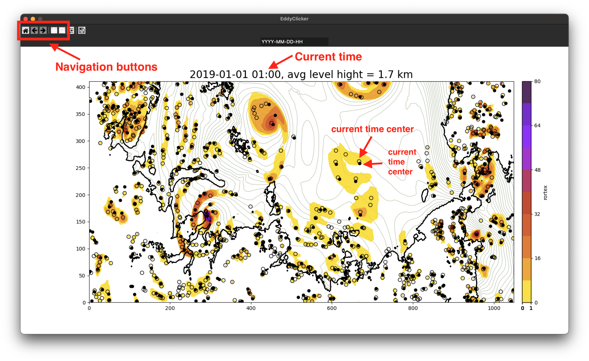

Авторы Елизавета Ежова и Гавриков Александр.
# Installation

```bash
git clone https://github.com/alexavr/EddyClicker.git
cd EddyClicker
conda env create --file environment.yml
conda activate clicker_env
python eddyclicker.py
```

If you need to **reinstall** the program, you should:

1. Copy the folder with the created tracks (see the section 'Configuration' below for more info) if it contains anything valuable.
2. Remove the conda environment: `conda remove -n clicker_env --all`.
3. After that, start the installation from scratch.
# Preparation 

1. Copy the data you plan to track into the *EddyClicker* folder
2. ... or use the test file `TEST.nc`.
3. Determine the names of the variables for the fields *rortex*, *geopotential*, *vortex centers*, and *topography* (these are the necessary fields). If additional fields are required to refine the boundaries of the vortex, you can add up to two more parameters, such as wind speed and cloud cover. In the application, you will be able to switch between these fields at any time (see the section 'Tracking Procedure').

# Configuration
Configuration is done in the file `const.py`. The variables `SCREEN_HEIGHT` and `WINDOW_WIDTH` are responsible for the size of the GUI window (depending on the shape of the field, it may be useful to change this). `FILE_RORTEX` is the name of the input file. `TRACKS_FOLDER` is the name of the folder where the tracks will be saved. If the incoming variables have also a vertical dimension, the variable `LEVEL` must be assigned the value of the desired height level. The names of the required variables for rortex, structure center fields, geopotential, and topography in the original file are: `RORTEX_VARNAME`, `LOCAL_EXTR_VARNAME`, `GEOPOTENTIAL_VARNAME`, and `HGT_VARNAME`. The `SCALARS` array describes the variables that need to be displayed in addition to the rortex: the variable `GEOPOTENTIAL_VARNAME` is mandatory and must be present in any case. Other variables (in the test file, these are cloud cover and wind speed fields) are auxiliary and help in determining the boundaries of the vortex. Switching between them is done using the keys `q`, `w`, and `e`. 

Below is an example of a configuration file, specifically the part that usually requires modification. The rest should only be changed if you are certain about what you're doing!:
```python
###############################################################################
### CHANGE THIS START #########################################################

# GUI WINDOWS SIZE
SCREEN_HEIGHT = 850
WINDOW_WIDTH = 1500

# INPUT AND OUTPUT FILE 
FILE_RORTEX = "TEST.nc"  
TRACKS_FOLDER = "track_folder"  # track output folder

# REQUIRED VARIABLES
LEVEL = 0 # Level of interest
RORTEX_VARNAME = "R2D" # Rortex variable to plot
LOCAL_EXTR_VARNAME = "local_extr_cluster" # dots to plot (scatter)
GEOPOTENTIAL_VARNAME = "geopotential" # contour to plot above Rortex field
HGT_VARNAME = "HGT" # coastline plot (2D curve)

# OTHER VARIABLES (vars to help recognize vortices)
SCALARS = [
{"name":GEOPOTENTIAL_VARNAME, "fill": False, "step": 50, "cmap": ""},# REQUIRED, Key Q
{"name":"cloudfrac", "fill": True , "step": 0.01, "cmap": "binary_r"},# Optional, Key W
{"name":"WSPD", "fill": True , "step": 1, "cmap": "viridis" },   # Optional, Key E
]

### CHANGE THIS END   #########################################################
###############################################################################
```
# Tracking

The program runs:
```bash
python eddyclicker.py
```
A window will open, where the coastline is shown with a black curve, the rortex field is displayed in color, the geopotential field is shown with contour lines, and hollow circles represent vortex centers. In the first time step, you won't be able to do anything, so you need to press `->` to move to the next time step. Now, black dots will appear—these are the vortex centers from the previous time step. You need to do  left mouse button click (LMC) on a black dot and then on a hollow circle—this will be the first segment of the trajectory. Next, we define the size of the vortex by marking an ellipse that will encompass the vortex. The first two LMC's  designate the major (longest) axis of the ellipse. The third click marks the minor axis. After this, a blue ellipse will be displayed, enclosing your vortex. You can zoom in or move the image using the *matplotlib* system buttons.



**NOTE: THE PROGRAM'S ALGORITHM ALLOWS YOU TO TRACE ONLY ONE VORTEX AT A TIME!**

Navigation between time steps is done using the arrow keys. `->` and `<-`.

Once the track has been completed (the vortex has ended its life), right-click and answer 'Yes' to the prompt about saving the file. Then proceed to the next vortex.

After the track has been saved, it is removed from the database, and you will no longer see the points of its centers.


# Tips

1. It's better for the ellipse to be larger than the vortex rather than smaller.
2. If the vortex didn't fit into the ellipse as you intended, press `Ctrl+Z` to undo your actions.
3. If the entire track seems suspicious, you can end it prematurely: right-click and in the pop-up window, answer 'No' to the prompt about saving.
4. You can always go back to the previous or next time step for getting know your vortex.
